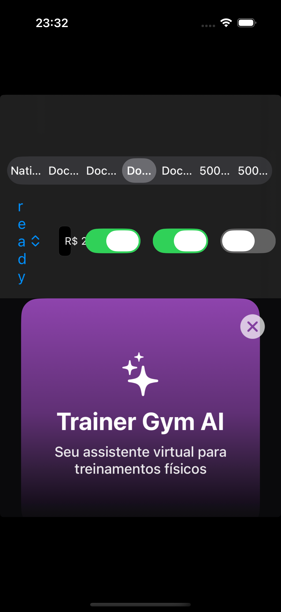

# Pororoca OTA Phase 1A — Signed local updates

## Status

Implemented. Phase 1A closes the trust and recovery loop locally before a network client or service is introduced.

## Security contract

- A publisher-generated Ed25519 keypair belongs to one app. The private key stays on the developer machine or in CI; the raw public key is embedded in the app.
- `manifest.json` contains a manifest, a public-key identifier, and a detached signature over canonical JSON bytes.
- Every document and asset is content-addressed with SHA-256. Verification rejects an unknown manifest key, unsafe relative path, duplicate path or screen, wrong public key, bad signature, missing file, hash mismatch, invalid document, platform mismatch, or incompatible known host.
- Documents remain data-only and pass through the existing strict decoder and validator before staging.

## Bundle layout

```text
update/
├── manifest.json
├── documents/
│   └── <sha256>.json
└── assets/
    └── <sha256>
```

The publisher writes the complete bundle to a temporary sibling directory, verifies it using the derived public key, then renames it into place.

## Store lifecycle

```text
verified bundle → pending
pending + next launch → current (old current → previous) + applying marker
10 seconds alive → good marker
next launch still sees applying → current becomes bad, previous is restored
no previous → embedded document
```

`UpdateStore` serializes mutations through an actor. Promotion has a transaction record so an interrupted directory move is completed or restored on the next launch. Updates recorded in `bad.json` cannot be staged again under the same update ID. `rollbackToEmbedded()` removes all downloaded state.

## Publisher commands

```sh
swift run pororoca keys generate --output <directory>
swift run pororoca validate <documents> [--platform ios|android]
swift run pororoca export <documents> \
  --output <bundle> \
  --update-id <id> \
  --private-key <file> \
  [--assets <directory>] \
  [--platform ios|android] \
  [--force]
swift run pororoca publish <bundle> \
  --store <store-directory> \
  --public-key <file>
```

`publish` is deliberately local in Phase 1A. Phase 1B will replace its destination with the authenticated update API while preserving the bundle and verification contracts.

Key generation refuses to overwrite an existing keypair. Export also refuses to overwrite an existing bundle unless `--force` is explicit. `.pororoca/` and `private.key` are ignored by Git.

## PaywallSpike workflow

The spike checks its Documents directory for:

- `pororoca-public.key` — raw or Base64-encoded 32-byte public key.
- `pororoca-incoming/` — an exported update bundle to verify and stage.

Valid incoming updates are available under `Document (signed)` and become good after the app remains alive for ten seconds. Invalid incoming bundles move to `PororocaRejected/<uuid>/` with an `error.txt` explanation. The active store lives in `Documents/PororocaOTA/`.

For a simulator, obtain the data container with:

```sh
xcrun simctl get_app_container booted dev.pororoca.PaywallSpike data
```

Copy the public key and exported bundle into that container's `Documents` directory before relaunching the app.
Pass `--signed-update` when launching the spike to open the signed renderer immediately.

## Verification

- Package tests cover canonical encoding, signing, tampering, wrong keys, unsafe paths, document and asset hashes, host compatibility, incomplete staging, promotion, good markers, bad-update quarantine, previous-update recovery, and rollback to embedded.
- PaywallSpike tests cover valid signed-update application and tampered-update quarantine.
- The publisher has been exercised end-to-end through key generation, validation, export, and local publish.
- A clean simulator proof validated, signed, staged, and rendered `simulator-proof-v2`; after ten seconds its persisted launch marker was `good`.


